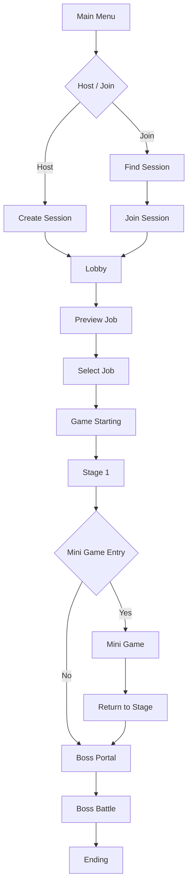

# BangSquad

> **Unreal Engine 5 기반 Listen Server 4인 협동 액션 RPG**  
> 서로 다른 직업을 선택한 플레이어들이 스테이지, 미니게임, 보스전을 협력해 돌파하는 멀티플레이 프로젝트입니다.

<p align="center">
  <a href="YOUTUBE_LINK">
    
  </a>
</p>

<p align="center">
  <a href="YOUTUBE_LINK">🎬 플레이 영상</a>
  &nbsp; | &nbsp;
  <a href="PORTFOLIO_PDF_LINK">📄 기술 문서 PDF</a>
  &nbsp; | &nbsp;
  <a href="REPOSITORY_LINK">💻 GitHub Repository</a>
</p>

---

## 프로젝트 한눈에 보기

**BangSquad**는 역할 분담과 협동을 중심으로 진행되는  
**Listen Server 기반 4인 멀티플레이 액션 RPG**입니다.

이 프로젝트에서 저는 다음과 같은 **멀티플레이 핵심 흐름**을 담당했습니다.

- OnlineSubsystem 기반 세션 생성, 검색, 참가
- 로비 Phase 동기화와 Late Join 대응
- 서버 권한 기반 직업 선택 검증
- 스테이지 이동 및 상태 복원
- 미니게임 순위 계산과 Arena 상태 머신

핵심 목표는 단순히 멀티플레이를 연결하는 것이 아니라,  
**세션부터 로비, 스테이지, 미니게임까지 상태 일관성이 유지되는 협동 플레이 구조를 만드는 것**이었습니다.

---

## 프로젝트 개요

| 항목 | 내용 |
|---|---|
| 프로젝트명 | BangSquad |
| 프로젝트 유형 | 기업협약 팀 프로젝트 |
| 장르 | 3D 협동 액션 RPG |
| 개발 기간 | 2025.12.22 ~ 2026.03.06 (75일) |
| 개발 인원 | 개발 4명 / 기획 1명 |
| 플랫폼 | Windows PC |
| 엔진 | Unreal Engine 5 |
| 언어 | C++ |
| 형상 관리 | GitHub |
| 개발 도구 | Rider |
| 네트워크 | Listen Server, OnlineSubsystem, Replication, RPC |

---

## 내가 담당한 기능

### 1. Multiplayer Session

- Listen Server 기반 세션 생성, 검색, 참가 흐름 구현
- LAN / Steam OnlineSubsystem 환경 분기
- Ready 상태 및 플레이어 목록 동기화
- 세션 완료 Delegate 기준 후속 처리 연결

### 2. Lobby

- RepNotify 기반 Lobby Phase 동기화
- 서버 권한 기반 직업 선택 및 중복 방지
- 플레이어별 직업 상태 저장
- Late Join 플레이어 상태 복원
- UI 반응과 네트워크 상태 관리 분리

### 3. Stage

- Portal 기반 스테이지 전환
- DataAsset 기반 이동 대상 관리
- CheckPoint 저장 및 복원
- 오브젝트 상태 저장 및 복원
- 리스폰 및 관전 시스템
- 게임 모드별 리스폰 정책 분리

### 4. Mini Game

- 실시간 순위 계산 및 동기화
- Arena Phase 상태 머신 구현
- 결과 집계 및 UI 반영
- 플레이어 탈락 및 생존 순위 처리

---

## 기술적으로 집중한 문제

이 README는 게임 전체 소개보다,  
제가 맡은 멀티플레이 시스템 설계와 해결 과정이 잘 보이도록 구성했습니다.

특히 아래 문제를 어떻게 풀었는지에 초점을 맞췄습니다.

1. **세션 비동기 처리**
세션 API 완료 이전에 Travel이 실행되지 않도록 Delegate 기반 흐름으로 제어했습니다.

2. **Late Join 상태 복원**
RPC 대신 RepNotify 기반 상태 복제를 사용해, 나중에 접속한 플레이어도 현재 로비 상태를 정상적으로 복원할 수 있게 했습니다.

3. **직업 선택 Race Condition**
클라이언트 UI 비활성화만으로는 막을 수 없는 동시 선택 문제를 서버 권한 검증 구조로 해결했습니다.

4. **스테이지 복귀 후 상태 유지**
미니게임 이후 복귀 시 퍼즐과 상호작용 오브젝트가 초기화되지 않도록 `ISaveInterface` 기반 저장/복원 구조를 구성했습니다.

5. **서버 기준 순위 계산**
체크포인트 진행도와 거리 정보를 조합해 실시간 순위를 계산하고, 이를 서버 기준으로 일관되게 동기화했습니다.

---

## 핵심 구현

### 1. OnlineSubsystem 기반 멀티플레이 세션

OnlineSubsystem의 세션 API는 비동기로 동작하기 때문에,  
세션 요청 직후 Travel을 수행하지 않고 **완료 Delegate를 기준으로 후속 처리를 실행**하도록 구성했습니다.

```text
CreateSession
  → OnCreateSessionComplete
  → ServerTravel
```

```text
FindSessions
  → OnFindSessionsComplete
  → Server List UI Update
```

```text
JoinSession
  → OnJoinSessionComplete
  → ClientTravel
```

### 구현 포인트

- 세션 생성 완료 후 `ServerTravel`
- 세션 검색 완료 후 서버 목록 UI 갱신
- 세션 참가 완료 후 `ClientTravel`
- 비동기 완료 이전의 잘못된 Travel 호출 방지
- LAN과 Steam 환경에서 세션 흐름은 동일하게 유지
- OnlineSubsystem 종류에 따라 `SessionSettings`만 분기

### 관련 코드

- `BSGameInstance`
- Session Create / Find / Join 로직
- Server List Widget 연동 코드

---

### 2. RepNotify 기반 Lobby Phase 동기화

로비는 다음 3개의 Phase로 구성됩니다.

```text
PreviewJob
  → SelectJob
  → GameStarting
```

서버의 `LobbyGameMode`가 Phase 전환 조건을 판단하고,  
`LobbyGameState`의 `CurrentPhase`를 변경하도록 구성했습니다.

```text
LobbyGameMode
  → CurrentPhase 변경
  → LobbyGameState Replication
  → OnRep_CurrentPhase
  → Delegate Broadcast
  → Lobby UI 갱신
```

### 왜 RepNotify를 사용했는가

단순 RPC는 이벤트 발생 순간만 전달하기 때문에,  
RPC 호출 이후 접속한 Late Join 플레이어가 현재 상태를 알 수 없습니다.

반면 RepNotify는 현재 상태값 자체를 복제하므로,  
Late Join 플레이어도 접속 시점의 로비 Phase를 복원할 수 있습니다.

### 관련 코드

- `LobbyGameMode`
- `LobbyGameState`
- `LobbyPlayerController`

---

### 3. 서버 권한 기반 직업 선택

직업 선택은 클라이언트 UI가 아니라  
**서버의 `LobbyGameMode`가 최종 승인**하도록 구성했습니다.

```text
Client Job Request
  → LobbyPlayerController
  → LobbyGameMode Validation
  → LobbyGameState TakenJobs Update
  → LobbyPlayerState Job Update
  → Client UI Sync
```

### 상태별 책임

| 클래스 | 책임 |
|---|---|
| `LobbyGameMode` | 직업 선택 요청 검증 및 승인 |
| `LobbyGameState` | 전체 직업 점유 상태 관리 |
| `LobbyPlayerState` | 플레이어별 확정 직업 관리 |
| `GameInstance` | 맵 전환 이후 로컬 UI 복원용 캐시 |

공용 상태와 개인 상태, 로컬 복원 데이터를 분리하여  
직업 선택과 맵 전환을 안정적으로 처리했습니다.

---

### 4. DataAsset 기반 스테이지 이동

스테이지 이동 대상은 `Stage Index`와 `Section`으로 결정하고,  
DataAsset에서 실제 Level과 관련 UI 리소스를 조회하도록 구성했습니다.

```text
Portal Enter
  → Player Count Check
  → Countdown
  → Stage Index / Section Resolve
  → MapDataAsset Lookup
  → ServerTravel
```

### 왜 DataAsset을 사용했는가

이동 데이터에는 Level뿐 아니라 Loading Image, Result Image 등  
여러 Unreal Asset 참조가 필요했습니다.

따라서 단순 데이터 중심의 DataTable보다  
Asset 참조 관리가 편리한 DataAsset을 사용했습니다.

---

### 5. Interface 기반 오브젝트 상태 저장 및 복원

미니게임 이후 기존 스테이지로 복귀할 때  
퍼즐과 오브젝트 상태가 초기화되는 문제를 해결하기 위해  
`ISaveInterface` 기반 저장 구조를 구현했습니다.

```text
ISaveInterface Actor Collect
  → SaveActorData()
  → SaveID 기준 저장
  → Stage Re-enter
  → Save Data Lookup
  → LoadActorData()
```

### 설계 포인트

- 저장 대상은 `ISaveInterface` 구현 객체로 제한
- 저장 시스템은 인터페이스 함수만 호출
- 실제 저장 데이터 구성은 각 객체가 담당
- SaveID를 기준으로 `GameInstance`에 저장
- 스테이지 재진입 시 SaveID로 상태 복원

```cpp
struct FActorSaveData
{
    FTransform ActorTransform;
    float FloatData;
    bool BoolData;
};
```

---

### 6. 서버 기반 실시간 순위 계산

미니게임 순위는 단순 거리만 사용하지 않고,  
체크포인트 진행도와 다음 체크포인트까지의 거리를 조합해 계산했습니다.

```text
CheckPoint Progress
  + Distance to Next CheckPoint
  = Progress Score
```

### 순위 결정 기준

1. 더 높은 CheckPoint에 도달한 플레이어 우선
2. 같은 CheckPoint 구간에서는 다음 CheckPoint까지 가까운 플레이어 우선
3. 완주자는 도착 순위를 유지
4. 미완주자는 최종 진행 점수로 순위 결정

### 네트워크 처리

- 순위 계산은 서버에서 수행
- CheckPoint와 순위 정보는 `PlayerState`로 동기화
- 클라이언트는 복제된 상태를 바탕으로 UI 갱신
- 최종 결과 UI만 각 클라이언트에 전달

---

### 7. Arena Phase 상태 머신

Arena 미니게임은 다음 4단계 Phase로 구성됩니다.

```text
Waiting
  → Surviving
  → FloorSinking
  → Finished
```

### Phase별 역할

| Phase | 처리 내용 |
|---|---|
| Waiting | 게임 시작 대기 및 카운트다운 |
| Surviving | 생존전 진행 및 축소까지 남은 시간 표시 |
| FloorSinking | Arena Floor 하강 및 전장 축소 |
| Finished | 최후 생존자 결정 및 결과 UI 출력 |

Phase 상태는 `GameState`에 복제하고,  
UI 반응은 `PlayerController` RPC로 분리하여  
상태 관리와 화면 처리를 독립적으로 유지했습니다.

---

## 트러블슈팅

### 동시에 같은 직업을 선택할 수 있는 Race Condition

직업 선택 버튼을 클라이언트에서 비활성화하는 방식만으로는  
패킷이 서버에 도착하기 전에 두 플레이어가 동시에 같은 직업을 선택할 수 있었습니다.

```text
Client A: Job Request ─┐
                       ├─ 거의 동시에 서버 도착
Client B: Job Request ─┘
```

### 해결 방식

- 전체 직업 점유 상태를 `LobbyGameState`에서 관리
- 플레이어별 확정 직업은 `LobbyPlayerState`에서 관리
- 모든 직업 선택 요청을 `LobbyGameMode`에서 서버 권한으로 최종 검증
- 기존 직업 해제와 신규 직업 등록을 하나의 서버 처리 흐름으로 구성

```cpp
bool ALobbyGameMode::TryConfirmJob(...)
{
    if (!GameState->IsJobAvailable(Job))
    {
        return false;
    }

    if (RequestingPlayerState->GetIsConfirmedJob())
    {
        GameState->RemoveTakenJob(
            RequestingPlayerState->GetSavedJobType()
        );
    }

    GameState->AddTakenJob(Job);
    RequestingPlayerState->SetSavedJobType(Job);
    RequestingPlayerState->SetIsConfirmedJob(true);

    return true;
}
```

### 결과

동시에 같은 직업을 요청하더라도  
서버가 먼저 승인한 하나의 요청만 유효하도록 구성했습니다.

### RPC만으로 Lobby Phase를 전달했을 때의 Late Join 문제

RPC는 호출 순간의 이벤트만 전달하므로,  
RPC 호출 이후 접속한 플레이어는 현재 Lobby Phase를 알 수 없습니다.

### 해결 방식

- `CurrentPhase`를 `GameState`에 저장
- RepNotify로 클라이언트에 복제
- `OnRep_CurrentPhase()`에서 UI 갱신 Delegate 호출

### 결과

기존 플레이어뿐 아니라 Late Join 플레이어도  
접속 시점의 로비 상태를 정상적으로 복원할 수 있게 되었습니다.

---

## 게임 진행 구조



---

## 코드 리뷰 가이드

아래 순서로 보면 전체 구조를 빠르게 파악할 수 있습니다.

1. `BSGameInstance`
세션 생성, 검색, 참가와 Travel 흐름

2. `LobbyGameMode`
Lobby Phase 전환과 직업 선택 서버 검증

3. `LobbyGameState`
`CurrentPhase` RepNotify와 전체 직업 점유 상태

4. `LobbyPlayerState`
플레이어별 확정 직업과 Late Join 대응 데이터

5. `StageGameMode`
스테이지 이동, 체크포인트, 리스폰, 오브젝트 상태 복원

6. `MiniGameGameState`
실시간 순위 계산과 Arena Phase 상태 머신

---

## 기술 스택

| 분류 | 사용 기술 |
|---|---|
| Engine | Unreal Engine 5 |
| Language | C++ |
| IDE | Rider |
| Network | Listen Server |
| Online | OnlineSubsystem LAN / Steam |
| Data | DataAsset |
| Framework | Unreal Gameplay Framework |
| Version Control | GitHub |

---

## 참고 사항

- 이 저장소는 포트폴리오용 프로젝트 소개를 목적으로 정리했습니다.
- 실행 빌드 배포보다 영상과 구현 설명 중심으로 확인하는 것을 권장합니다.
- 저장소에 포함되지 않은 외부 에셋이나 환경 설정이 있다면 별도 문서나 PDF에서 함께 안내해 주세요.
