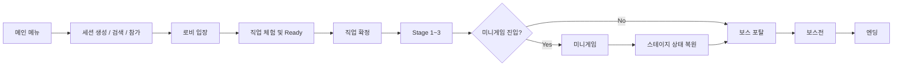
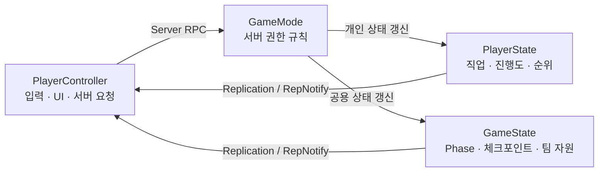

<div align="center">

# ⚔️ BangSquad

### 역할을 나누고, 함께 돌파하는 4인 협동 액션 RPG

**Unreal Engine 5 · C++ · Listen Server · Steam OnlineSubsystem**

[](https://www.unrealengine.com/)
[](https://isocpp.org/)
[](#-멀티플레이-아키텍처)
[](#-실행-방법)

<!-- 실제 링크로 교체해 주세요. -->
[플레이 영상](YOUR_YOUTUBE_URL) · [프로젝트 저장소](YOUR_GITHUB_URL) · [기술 문서](YOUR_DOCUMENT_URL)

</div>

---

## 📌 프로젝트 소개

**BangSquad**는 4명의 플레이어가 서로 다른 직업을 선택하고, 스테이지·미니게임·보스전을 협력해 돌파하는 **3D 협동 액션 RPG**입니다.

로비에서 역할을 확정한 뒤 최대 3개의 스테이지를 진행하며, 중간 미니게임에서는 실시간 순위를 겨루고 보스전에서는 제한된 팀 부활 자원을 함께 관리합니다. 네트워크 지연과 Late Join 상황에서도 게임 상태가 일관되게 보이도록 **서버 권한 기반 상태 관리**, **Replication/RepNotify**, **RPC 역할 분리**에 집중했습니다.

> 핵심 목표: “멀티플레이 환경에서도 게임 흐름과 플레이어 상태가 끊기지 않는 협동 경험”

---

## 🎮 게임 흐름



- **4인 Listen Server 멀티플레이**
- **로비 → 스테이지 → 미니게임 → 보스전**으로 이어지는 플레이 루프
- 서버 권한 기반 직업 선택 및 중복 방지
- 체크포인트, 리스폰, 관전, 팀 부활 시스템
- 미니게임 실시간 순위와 결과 집계

---

## 🖼️ 플레이 화면

<!-- 저장소에 이미지를 추가한 뒤 경로를 교체해 주세요. -->

| 로비 / 직업 선택 | 협동 스테이지 | 보스전 |
|:---:|:---:|:---:|
|  |  |  |

> GitHub 첫 화면에서는 정적 이미지보다 10~20초 길이의 핵심 플레이 GIF를 가장 위에 배치하는 것을 권장합니다.

---

## ✨ 주요 기능

### 멀티플레이 세션

- Listen Server 기반 세션 생성·검색·참가
- `CreateSession` / `FindSessions` / `JoinSession` 완료 Delegate에서만 Travel 수행
- LAN과 Steam 환경을 동일한 세션 흐름으로 유지하고 `SessionSettings`만 분기
- OnlineSubsystem 내부 타입을 UI에 직접 노출하지 않고 `FServerData` DTO로 변환

### 로비와 직업 선택

- `PreviewJob → SelectJob → GameStarting` Phase 기반 로비 흐름
- 서버가 Ready 및 직업 확정 조건을 판단
- `RepNotify`를 이용한 현재 Phase 복제와 Late Join 대응
- 서버 권한으로 직업 중복을 최종 검증하여 Race Condition 방지
- 공용 직업 점유 상태, 플레이어별 확정 직업, 로컬 UI 복구 캐시를 분리

### 스테이지 진행

- 포탈 진입 인원을 확인한 뒤 전원 집결 시 카운트다운 시작
- `Stage Index + Section`을 키로 이동할 레벨을 결정
- Level·Texture 참조가 필요한 맵 데이터를 `DataAsset`으로 관리
- `ServerTravel` 기반 스테이지 전환

### 상태 저장 및 복원

- 미니게임 진입 전 퍼즐·오브젝트 상태 저장
- `ISaveInterface` 구현 객체를 수집해 공통 저장 파이프라인 구성
- `SaveID`를 기준으로 `GameInstance`에 상태를 보관하고 재진입 시 복원
- 새로운 저장 대상 추가 시 기존 저장 로직 수정 없이 확장 가능

### 미니게임

- 체크포인트 진행도와 다음 체크포인트까지의 거리로 실시간 순위 계산
- 서버에서 순위를 계산하고 `PlayerState`로 동기화
- `Waiting → Surviving → FloorSinking → Finished` 상태 머신 기반 Arena 진행
- 상태 관리와 UI 반응을 분리해 미니게임별 흐름을 독립적으로 유지

### 리스폰·관전·체크포인트

- 일반 스테이지, 미니게임, 보스전의 리스폰 정책을 `GameMode` 단위로 분리
- 개인 상태는 `PlayerState`, 팀 공유 상태는 `GameState`에서 관리
- 일반 스테이지: 사망 횟수 기반 리스폰 지연 증가
- 미니게임: 개인 진행도·사망 상태 기반 복귀
- 보스전: 팀 공용 부활 횟수 기반 복귀

---

## 🧱 멀티플레이 아키텍처



| 클래스 | 책임 |
|---|---|
| `PlayerController` | 입력 처리, UI 제어, 상호작용, 관전 전환, 서버 요청 전달 |
| `GameMode` | 서버 권한 규칙, 스폰·리스폰, Phase 및 스테이지 전환, 보상 지급 |
| `PlayerState` | 플레이어별 직업, 진행도, 순위, QTE 입력 상태, Late Join 복구 데이터 |
| `GameState` | 공용 Phase, 체크포인트, 팀 부활 횟수, 전체 플레이어 공유 정보 |
| `GameInstance` | 세션 관리, 맵 전환 사이에서 유지해야 하는 로컬 캐시 및 저장 데이터 |

### 네트워크 설계 원칙

1. **규칙 판정은 서버에서 수행**합니다.
2. **지속 상태는 Replication/RepNotify**, 순간 요청은 RPC로 전달합니다.
3. UI는 복제된 상태를 구독하며 게임 규칙 객체와 직접 결합하지 않습니다.
4. Late Join 플레이어도 현재 상태를 즉시 복구할 수 있도록 이벤트보다 상태 중심으로 설계합니다.

---

## 🛠️ 기술 스택

| 분류 | 기술 |
|---|---|
| Engine | Unreal Engine 5 |
| Language | C++ |
| Networking | Listen Server, OnlineSubsystem, Replication, RepNotify, RPC |
| Architecture | Unreal Gameplay Framework, Phase State Machine, Interface-based Save System |
| Data | DataAsset, DTO (`FServerData`), `GameInstance` Cache |
| Tools | JetBrains Rider, Git, GitHub |
| Online | LAN / Steam OnlineSubsystem |

---

## 🔍 기술적으로 신경 쓴 부분

### 1. 비동기 세션 API와 Travel 순서 보장

OnlineSubsystem 세션 API는 비동기로 완료됩니다. 세션 요청 직후 Travel을 실행하면 세션 생성 또는 참가가 끝나기 전에 맵 이동이 발생할 수 있어, 모든 이동과 UI 갱신을 완료 Delegate 내부에서만 수행하도록 흐름을 통제했습니다.

```text
Create Session → OnCreateSessionComplete → ServerTravel
Find Sessions  → OnFindSessionsComplete   → Server List Update
Join Session   → OnJoinSessionComplete    → ClientTravel
```

### 2. 이벤트가 아닌 상태 복제로 Late Join 대응

RPC만으로 Phase 변경 이벤트를 전달하면, 이벤트 발생 이후 접속한 플레이어는 현재 Phase를 알 수 없습니다. 이를 해결하기 위해 `CurrentPhase`를 `RepNotify`로 복제하고, `OnRep_CurrentPhase()`에서 Delegate를 Broadcast하도록 구성했습니다.

이 방식은 다음 효과를 가집니다.

- Late Join 플레이어가 현재 로비 Phase를 즉시 복구
- `GameState`와 UI 사이의 결합도 감소
- UI를 직접 호출하지 않고 상태 변경 이벤트만 전달

### 3. 서버 권한 기반 Race Condition 해결

두 클라이언트가 거의 동시에 같은 직업을 선택하면, 클라이언트 UI 비활성화만으로는 패킷 도착 순서를 보장할 수 없습니다.

최종 직업 확정은 `LobbyGameMode::TryConfirmJob()`에서 처리하고, 서버가 공용 직업 점유 상태를 검사한 뒤 단 하나의 요청만 승인하도록 구현했습니다.

```text
클라이언트 직업 확정 요청
        ↓
LobbyGameMode 서버 검증
        ↓
LobbyGameState 점유 상태 갱신
        ↓
LobbyPlayerState 확정 직업 저장
```

### 4. 인터페이스 기반 객체 상태 저장

미니게임 이후 원래 스테이지로 돌아오면 퍼즐과 오브젝트가 초기화되는 문제를 해결하기 위해 `ISaveInterface`를 도입했습니다.

- 저장 대상 탐색: 인터페이스 구현 여부
- 저장 데이터 생성: 각 객체가 직접 담당
- 저장소: `GameInstance`
- 복원 키: `SaveID`

저장 시스템이 구체적인 액터 타입을 알 필요가 없어, 새로운 저장 대상을 추가해도 기존 저장 코드를 수정하지 않습니다.

### 5. 동일 체크포인트 구간에서도 순위를 구분

단순 체크포인트 번호만 비교하면 같은 구간에 있는 플레이어의 순위를 구분할 수 없습니다. 따라서 아래 두 값을 조합해 진행 점수를 계산했습니다.

```text
진행 점수 = 체크포인트 진행도 + 다음 체크포인트까지의 거리 기반 진행도
```

순위 계산은 서버에서 수행하고, 체크포인트와 순위 정보는 `PlayerState`로 복제하며, 최종 결과 UI만 각 클라이언트에 전달합니다.

---

## 🧩 문제 해결 경험

### 직업 중복 선택 Race Condition

**문제**  
UI에서 이미 선택된 직업 버튼을 비활성화했지만, 네트워크 지연 때문에 두 명이 동시에 같은 직업을 확정할 수 있었습니다.

**원인**  
클라이언트 UI는 서버의 최신 상태를 보장하지 않으며, 요청 패킷이 도착하기 전에는 다른 클라이언트의 선택을 알 수 없습니다.

**해결**  
공용 직업 점유 상태는 `LobbyGameState`, 플레이어별 확정 직업은 `LobbyPlayerState`로 분리하고, `LobbyGameMode`가 서버 권한으로 최종 검증하도록 변경했습니다.

**결과**  
동시 요청에서도 하나의 직업만 확정되며, 직업 변경 시 기존 점유 상태와 신규 점유 상태를 일관되게 관리할 수 있게 되었습니다.

### 미니게임 복귀 후 오브젝트 초기화

**문제**  
미니게임 맵을 다녀온 뒤 원래 스테이지로 복귀하면 퍼즐과 상호작용 오브젝트 상태가 초기화되었습니다.

**해결**  
맵 이동 전 `ISaveInterface` 구현 객체를 수집하고, 각 객체가 자신의 상태를 `FActorSaveData`로 직렬화하도록 구성했습니다. 재진입 시 `SaveID`로 데이터를 조회해 복원했습니다.

**결과**  
맵 전환 이후에도 스테이지 진행 상태가 유지되며, 저장 대상 확장 비용도 낮아졌습니다.

---

## 📂 권장 문서 구조

```text
BangSquad/
├─ Config/
├─ Content/
├─ Source/
│  └─ BangSquad/
├─ Docs/
│  ├─ Images/
│  │  ├─ hero.gif
│  │  ├─ lobby.png
│  │  ├─ stage.png
│  │  └─ boss.png
│  └─ BangSquad_Technical_Document.pdf
├─ BangSquad.uproject
└─ README.md
```

---

## 🚀 실행 방법

> 아래 값은 실제 프로젝트 환경에 맞게 확정해 주세요.

### 요구 사항

- Unreal Engine 5.x
- Windows 10/11
- Visual Studio 2022 또는 JetBrains Rider
- C++ 데스크톱 개발 워크로드
- Steam 테스트 시 Steam Client 및 프로젝트용 App ID 설정

### 에디터 실행

```bash
# 1. 저장소 복제
git clone YOUR_GITHUB_URL
cd BangSquad

# 2. BangSquad.uproject 우클릭
#    → Generate Visual Studio project files

# 3. 솔루션 빌드 후 BangSquad.uproject 실행
```

### 멀티플레이 테스트

- **LAN 테스트**: Steam 없이 동일 네트워크에서 Host / Join
- **Steam 테스트**: Steam OnlineSubsystem 활성화 후 각기 다른 Steam 계정으로 실행
- 세션 생성자는 Listen Server가 되며, 참가자는 서버 목록에서 세션을 선택해 입장합니다.

---

## 👥 팀 구성

| 구분 | 인원 | 담당 |
|---|---:|---|
| 개발 | 4명 | 게임플레이, 네트워크, UI, 시스템 구현 |
| 기획 | 1명 | 콘텐츠 및 게임 기획 |
| 전체 | 5명 | 기업 협약 팀 프로젝트 |

### 담당 역할

- 멀티플레이 세션 생성·검색·참가
- LAN / Steam OnlineSubsystem 분기
- 로비 Phase 및 플레이어 목록 동기화
- 서버 권한 직업 선택과 중복 방지
- 스테이지 전환, 체크포인트, 리스폰, 관전
- 미니게임 진행 상태와 실시간 순위
- 인터페이스 기반 스테이지 상태 저장·복원

---

## 🗓️ 개발 정보

- **개발 기간:** 2025.12.22 ~ 2026.03.06 (75일)
- **장르:** 3D 협동 액션 RPG
- **프로젝트 유형:** 기업 협약 팀 프로젝트
- **개발 인원:** 개발 4명 + 기획 1명

---

## 🤖 AI 활용

프로젝트 진행 과정에서 AI를 다음 용도로 활용했습니다.

- 네트워크 구조와 기능 단위 설계 검토
- C++ 코드 초안 및 리팩터링 아이디어 정리
- 오류 메시지와 크래시 원인 분석 보조
- 테스트 시나리오 및 예외 상황 체크리스트 작성
- 기술 문서와 README 초안 구성

AI가 제안한 내용은 프로젝트 구조와 Unreal Engine 네트워크 권한 모델에 맞는지 검토한 뒤 적용하고, 멀티 클라이언트 환경에서 직접 테스트했습니다.

---

## 🔗 링크

- **GitHub:** YOUR_GITHUB_URL
- **플레이 영상:** YOUR_YOUTUBE_URL
- **기술 문서:** YOUR_DOCUMENT_URL
- **빌드 다운로드:** YOUR_RELEASE_URL

---

## 📝 회고

BangSquad를 개발하며 멀티플레이 게임에서 중요한 것은 단순히 데이터를 복제하는 것이 아니라, **어떤 객체가 규칙을 판단하고 어떤 상태를 어디에 보관할지 명확히 나누는 것**임을 배웠습니다.

특히 서버 권한 직업 선택, RepNotify 기반 Phase 동기화, 인터페이스 기반 상태 저장을 구현하면서 네트워크 지연·Late Join·맵 전환과 같은 실제 멀티플레이 문제를 구조적으로 해결하는 경험을 얻었습니다.

다음 프로젝트에서는 자동화된 멀티클라이언트 테스트, 네트워크 프로파일링, Dedicated Server 확장까지 고려해 더 안정적인 온라인 게임 아키텍처를 설계할 계획입니다.

---

<div align="center">

**⭐ 프로젝트가 흥미로웠다면 Star로 응원해 주세요!**

</div>
