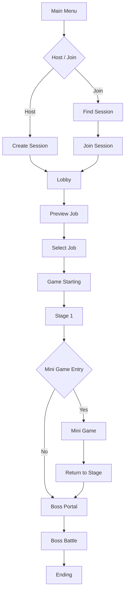

# BangSquad

> **Unreal Engine 5 기반 Listen Server 4인 협동 액션 RPG**  
> 플레이어들이 서로 다른 직업을 선택하고, 스테이지와 미니게임, 보스전을 협력하여 진행하는 멀티플레이 게임입니다.

<p align="center">
  <a href="YOUTUBE_LINK">
    
  </a>
</p>

<p align="center">
  <a href="YOUTUBE_LINK">🎬 플레이 영상</a>
  &nbsp; | &nbsp;
  <a href="PORTFOLIO_PDF_LINK">📄 기술문서 PDF</a>
  &nbsp; | &nbsp;
  <a href="BUILD_LINK">🎮 실행 파일</a>
</p>

---

## 목차

1. [프로젝트 소개](#프로젝트-소개)
2. [프로젝트 개요](#프로젝트-개요)
3. [담당 기능](#담당-기능)
4. [기술적 하이라이트](#기술적-하이라이트)
5. [핵심 구현](#핵심-구현)
6. [트러블슈팅](#트러블슈팅)
7. [게임 진행 구조](#게임-진행-구조)
8. [코드 리뷰 가이드](#코드-리뷰-가이드)
9. [개발 환경](#개발-환경)
10. [실행 및 참고 사항](#실행-및-참고-사항)

---

## 프로젝트 소개

**BangSquad**는 역할을 나누어 스테이지와 미니게임, 보스전을 돌파하는  
**Listen Server 기반 4인 협동 액션 RPG**입니다.

게임은 다음 흐름으로 진행됩니다.

```text
Main Menu
  → Session Create / Find / Join
  → Lobby
  → Job Select / Ready
  → Stage 1 ~ 3
  → Mini Game
  → Boss
  → Ending
```

멀티플레이 상태의 일관성을 유지하기 위해 서버 권한 구조를 기준으로 설계했으며,  
`GameMode`, `GameState`, `PlayerState`, `PlayerController`, `GameInstance`의 책임을 분리하여  
세션, 로비, 스테이지, 미니게임의 흐름을 구성했습니다.

---

## 프로젝트 개요

| 항목 | 내용 |
|---|---|
| 프로젝트명 | BangSquad |
| 프로젝트 유형 | 기업협약 팀 프로젝트 |
| 장르 | 3D 협동 액션 RPG |
| 개발 기간 | 2025.12.22 ~ 2026.03.06 (75일) |
| 개발 인원 | 개발 4명 / 기획 1명 |
| 플랫폼 | Windows PC |
| 엔진 | Unreal Engine 5 |
| 언어 | C++ |
| 형상 관리 | GitHub |
| 개발 도구 | Rider |
| 네트워크 | Listen Server, OnlineSubsystem, Replication, RPC |

---

## 담당 기능

### Multiplayer

- Listen Server 기반 세션 생성, 검색, 참가 흐름 구현
- LAN / Steam OnlineSubsystem 환경 분기
- Ready 상태 및 플레이어 목록 동기화
- 서버 권한 기반 게임 시작 조건 처리

### Lobby

- RepNotify 기반 Lobby Phase 동기화
- 서버 권한 기반 직업 선택 및 중복 방지
- 플레이어별 직업 정보 저장
- Late Join을 고려한 상태 복원
- 직업 선택 UI와 네트워크 상태 분리

### Stage

- Portal 기반 스테이지 전환
- DataAsset 기반 이동 대상 관리
- CheckPoint 저장 및 복원
- 오브젝트 상태 저장 및 복원
- 리스폰 및 관전 시스템
- 게임 모드별 리스폰 정책 분리

### Mini Game

- 실시간 순위 계산 및 동기화
- Arena Phase 상태 머신 구현
- 결과 집계 및 UI 반영
- 플레이어 탈락 및 생존 순위 처리

---

## 기술적 하이라이트

| 영역 | 주요 기술 |
|---|---|
| Session | OnlineSubsystem 비동기 Delegate 기반 흐름 제어 |
| Network State | Replication, RepNotify, RPC |
| Server Authority | 서버 권한 기반 직업 선택 및 상태 검증 |
| Gameplay Framework | GameMode / GameState / PlayerState 책임 분리 |
| Stage Data | DataAsset 기반 레벨 및 리소스 참조 |
| Save System | Interface 기반 오브젝트 상태 저장 및 복원 |
| Ranking | CheckPoint 진행도와 거리 기반 실시간 순위 계산 |
| State Machine | Lobby 및 Arena Phase 상태 머신 |

---

# 핵심 구현

## 1. OnlineSubsystem 기반 멀티플레이 세션

OnlineSubsystem의 세션 API는 비동기로 동작하기 때문에,  
세션 요청 직후 Travel을 수행하지 않고 **완료 Delegate를 기준으로 후속 처리를 실행**하도록 구성했습니다.

```text
CreateSession
  → OnCreateSessionComplete
  → ServerTravel
```

```text
FindSessions
  → OnFindSessionsComplete
  → Server List UI Update
```

```text
JoinSession
  → OnJoinSessionComplete
  → ClientTravel
```

### 구현 포인트

- 세션 생성 완료 후 `ServerTravel`
- 세션 검색 완료 후 서버 목록 UI 갱신
- 세션 참가 완료 후 `ClientTravel`
- 비동기 완료 이전의 잘못된 Travel 호출 방지
- LAN과 Steam 환경에서 세션 흐름은 동일하게 유지
- OnlineSubsystem 종류에 따라 `SessionSettings`만 분기

### LAN / Steam 분기

| 설정 | LAN | Steam |
|---|---:|---:|
| `bIsLANMatch` | `true` | `false` |
| `bUsesPresence` | `false` | `true` |
| 검색 방식 | Broadcast | Presence |
| 연결 범위 | 동일 네트워크 | Steam 친구 및 온라인 세션 |

세션 생성과 검색 로직을 중복 구현하지 않고,  
실행 환경에 따라 설정값만 변경하도록 구성했습니다.

### 서버 목록 UI 의존성 분리

OnlineSubsystem 내부 타입인 `FOnlineSessionSearchResult`를  
UI에 직접 전달하지 않고 표시용 DTO인 `FServerData`로 변환했습니다.

```text
FOnlineSessionSearchResult
  → FServerData
  → Server List Widget
```

이를 통해 세션 검색 로직과 UI의 의존성을 분리하고,  
UI에는 서버 이름, 현재 인원, 최대 인원, 호스트 이름 등 필요한 데이터만 전달했습니다.

> 관련 코드  
> - `[GameInstance Session Code](SOURCE_LINK)`  
> - `[Server List UI Code](SOURCE_LINK)`

---

## 2. RepNotify 기반 Lobby Phase 동기화

로비는 다음 3개의 Phase로 구성됩니다.

```text
PreviewJob
  → SelectJob
  → GameStarting
```

서버의 `LobbyGameMode`가 Phase 전환 조건을 판단하고,  
`LobbyGameState`의 `CurrentPhase`를 변경하도록 구성했습니다.

```text
LobbyGameMode
  → CurrentPhase 변경
  → LobbyGameState Replication
  → OnRep_CurrentPhase
  → Delegate Broadcast
  → Lobby UI 갱신
```

### RepNotify를 사용한 이유

단순 RPC는 이벤트 발생 순간만 전달하기 때문에,  
RPC 호출 이후 접속한 Late Join 플레이어가 현재 상태를 알 수 없습니다.

반면 RepNotify는 현재 상태값 자체를 복제하므로,  
Late Join 플레이어도 접속 시점의 로비 Phase를 복원할 수 있습니다.

### 구현 포인트

- 서버에서만 Phase 전환 조건 판단
- `CurrentPhase`를 RepNotify로 복제
- `OnRep_CurrentPhase()`에서 Delegate Broadcast
- UI는 Delegate를 구독해 현재 Phase에 맞게 갱신
- GameState에서 UI를 직접 호출하지 않도록 결합도 감소
- 이벤트가 아닌 상태를 복제하여 Late Join 대응

> 관련 코드  
> - `[LobbyGameMode](SOURCE_LINK)`  
> - `[LobbyGameState](SOURCE_LINK)`  
> - `[LobbyPlayerController](SOURCE_LINK)`

---

## 3. 서버 권한 기반 직업 선택

직업 선택은 클라이언트 UI가 아니라  
**서버의 LobbyGameMode가 최종 승인**하도록 구성했습니다.

```text
Client Job Request
  → LobbyPlayerController
  → LobbyGameMode Validation
  → LobbyGameState TakenJobs Update
  → LobbyPlayerState Job Update
  → Client UI Sync
```

### 상태별 책임

| 클래스 | 책임 |
|---|---|
| `LobbyGameMode` | 직업 선택 요청 검증 및 승인 |
| `LobbyGameState` | 전체 직업 점유 상태 관리 |
| `LobbyPlayerState` | 플레이어별 확정 직업 관리 |
| `GameInstance` | 맵 전환 이후 로컬 UI 복원용 캐시 |

공용 상태와 개인 상태, 로컬 복원 데이터를 분리하여  
직업 선택과 맵 전환을 안정적으로 처리했습니다.

> 관련 코드  
> - `[Job Selection Validation](SOURCE_LINK)`  
> - `[LobbyPlayerState](SOURCE_LINK)`

---

## 4. DataAsset 기반 스테이지 이동

스테이지 이동 대상은 `Stage Index`와 `Section`으로 결정하고,  
DataAsset에서 실제 Level과 관련 UI 리소스를 조회하도록 구성했습니다.

```text
Portal Enter
  → Player Count Check
  → Countdown
  → Stage Index / Section Resolve
  → MapDataAsset Lookup
  → ServerTravel
```

### DataAsset를 선택한 이유

이동 데이터에는 Level뿐 아니라 Loading Image, Result Image 등  
여러 Unreal Asset 참조가 필요했습니다.

따라서 단순 데이터 중심의 DataTable보다  
Asset 참조 관리가 편리한 DataAsset을 사용했습니다.

### 구현 포인트

- 전원 진입 시 Countdown 시작
- 플레이어 이탈 시 Countdown 초기화
- `Stage Index / Section`으로 이동 대상 결정
- DataAsset에서 Level 조회
- 서버 권한으로 `ServerTravel` 수행

> 관련 코드  
> - `[Stage Portal](SOURCE_LINK)`  
> - `[MapDataAsset](SOURCE_LINK)`

---

## 5. Interface 기반 오브젝트 상태 저장 및 복원

미니게임 이후 기존 스테이지로 복귀할 때  
퍼즐과 오브젝트 상태가 초기화되는 문제를 해결하기 위해  
`ISaveInterface` 기반 저장 구조를 구현했습니다.

```text
ISaveInterface Actor Collect
  → SaveActorData()
  → SaveID 기준 저장
  → Stage Re-enter
  → Save Data Lookup
  → LoadActorData()
```

### 설계 포인트

- 저장 대상은 `ISaveInterface`만 구현
- 저장 시스템은 인터페이스 함수만 호출
- 실제 저장 데이터 구성은 각 객체가 담당
- SaveID를 기준으로 GameInstance에 저장
- 스테이지 재진입 시 SaveID로 상태 복원
- 새로운 저장 대상 추가 시 기존 저장 로직 수정 최소화

```cpp
struct FActorSaveData
{
    FTransform ActorTransform;
    float FloatData;
    bool BoolData;
};
```

> 관련 코드  
> - `[SaveInterface](SOURCE_LINK)`  
> - `[Stage Save System](SOURCE_LINK)`

---

## 6. 서버 기반 실시간 순위 계산

미니게임 순위는 단순 거리만 사용하지 않고,  
체크포인트 진행도와 다음 체크포인트까지의 거리를 조합해 계산했습니다.

```text
CheckPoint Progress
  + Distance to Next CheckPoint
  = Progress Score
```

### 순위 결정 기준

1. 더 높은 CheckPoint에 도달한 플레이어 우선
2. 같은 CheckPoint 구간에서는 다음 CheckPoint까지 가까운 플레이어 우선
3. 완주자는 도착 순위를 유지
4. 미완주자는 최종 진행 점수로 순위 결정

### 네트워크 처리

- 순위 계산은 서버에서 수행
- CheckPoint와 순위 정보는 PlayerState로 동기화
- 클라이언트는 복제된 상태를 바탕으로 UI 갱신
- 최종 결과 UI만 각 클라이언트에 전달

> 관련 코드  
> - `[MiniGame Ranking](SOURCE_LINK)`

---

## 7. Arena Phase 상태 머신

Arena 미니게임은 다음 4단계 Phase로 구성됩니다.

```text
Waiting
  → Surviving
  → FloorSinking
  → Finished
```

### Phase별 역할

| Phase | 처리 내용 |
|---|---|
| Waiting | 게임 시작 대기 및 카운트다운 |
| Surviving | 생존전 진행 및 축소까지 남은 시간 표시 |
| FloorSinking | Arena Floor 하강 및 전장 축소 |
| Finished | 최후 생존자 결정 및 결과 UI 출력 |

Phase 상태는 GameState에 복제하고,  
UI 반응은 PlayerController RPC로 분리하여  
상태 관리와 화면 처리를 독립적으로 유지했습니다.

> 관련 코드  
> - `[Arena GameState](SOURCE_LINK)`  
> - `[Arena Phase Logic](SOURCE_LINK)`

---

# 트러블슈팅

## 동시에 같은 직업을 선택할 수 있는 Race Condition

### 문제

직업 선택 버튼을 클라이언트에서 비활성화하는 방식만으로는  
패킷이 서버에 도착하기 전에 두 플레이어가 동시에 같은 직업을 선택할 수 있었습니다.

```text
Client A: Job Request ─┐
                       ├─ 거의 동시에 서버 도착
Client B: Job Request ─┘
```

클라이언트 UI 상태는 서버의 최종 상태를 보장하지 못하므로,  
중복 직업 선택을 완전히 차단할 수 없었습니다.

### 기존 방식의 한계

- UI 비활성화는 로컬 상태일 뿐 서버 상태를 보장하지 못함
- 네트워크 지연 중 다른 플레이어의 요청 상태를 알 수 없음
- 직업 변경 시 기존 직업 해제와 신규 직업 등록의 일관성 유지가 어려움

### 해결

- 전체 직업 점유 상태를 `LobbyGameState`에서 관리
- 플레이어별 확정 직업은 `LobbyPlayerState`에서 관리
- 모든 직업 선택 요청을 `LobbyGameMode`에서 서버 권한으로 최종 검증
- 기존 직업 해제와 신규 직업 등록을 하나의 서버 처리 흐름으로 구성

```cpp
bool ALobbyGameMode::TryConfirmJob(...)
{
    if (!GameState->IsJobAvailable(Job))
    {
        return false;
    }

    if (RequestingPlayerState->GetIsConfirmedJob())
    {
        GameState->RemoveTakenJob(
            RequestingPlayerState->GetSavedJobType()
        );
    }

    GameState->AddTakenJob(Job);
    RequestingPlayerState->SetSavedJobType(Job);
    RequestingPlayerState->SetIsConfirmedJob(true);

    return true;
}
```

### 결과

동시에 같은 직업을 요청하더라도  
서버가 먼저 승인한 하나의 요청만 유효하도록 구성했습니다.

---

## RPC만으로 Lobby Phase를 전달했을 때의 Late Join 문제

### 문제

RPC는 호출 순간의 이벤트만 전달하므로,  
RPC 호출 이후 접속한 플레이어는 현재 Lobby Phase를 알 수 없습니다.

### 해결

Phase를 이벤트가 아닌 복제 상태값으로 관리했습니다.

- `CurrentPhase`를 GameState에 저장
- RepNotify로 클라이언트에 복제
- `OnRep_CurrentPhase()`에서 UI 갱신 Delegate 호출

### 결과

기존 플레이어뿐 아니라 Late Join 플레이어도  
접속 시점의 로비 상태를 정상적으로 복원할 수 있게 되었습니다.

---

# 게임 진행 구조



---

# Gameplay Framework 책임 분리

| 클래스 | 주요 책임 |
|---|---|
| `GameMode` | 서버 권한 기반 규칙 처리, 스폰, 리스폰, 맵 전환 |
| `GameState` | 전체 플레이어가 공유하는 상태 복제 |
| `PlayerState` | 플레이어별 상태, 직업, 순위, 체크포인트 관리 |
| `PlayerController` | 입력, UI, 서버 요청 전달, 관전 전환 |
| `GameInstance` | 세션 관리 및 맵 전환 후 유지할 로컬 데이터 |

개인 상태는 PlayerState, 팀 공용 상태는 GameState,  
서버 전용 규칙은 GameMode에 배치하여 역할을 구분했습니다.

---

# 게임 모드별 리스폰 정책

| 구분 | 일반 스테이지 | 미니게임 | 보스전 |
|---|---|---|---|
| 리스폰 시간 | 사망 횟수에 따라 증가 | 고정 | 고정 |
| 리스폰 기준 | 개인 사망 횟수 | 개인 진행도 및 사망 상태 | 팀 부활 횟수 |
| 상태 관리 | PlayerState | PlayerState | GameState |
| 체크포인트 | 공용 | 개인 | 없음 |
| 부활 조건 | 대기시간 종료 | 대기시간 종료 | 팀 부활 횟수 잔여 |

게임 모드마다 다른 규칙을 GameMode에서 정책으로 분리하고,  
개인 상태와 팀 공유 상태를 PlayerState와 GameState에 나누어 관리했습니다.

---

# 코드 리뷰 가이드

아래 순서로 코드를 확인하면 전체 구조를 빠르게 이해할 수 있습니다.

1. `BSGameInstance`
   - Session Create / Find / Join
   - LAN / Steam 환경 분기
   - ServerTravel / ClientTravel 흐름

2. `LobbyGameMode`
   - Lobby Phase 전환 조건
   - 직업 선택 서버 검증
   - Ready 및 게임 시작 처리

3. `LobbyGameState`
   - `CurrentPhase` RepNotify
   - 전체 직업 점유 상태
   - 로비 공용 상태 동기화

4. `LobbyPlayerState`
   - 플레이어별 확정 직업
   - Late Join 대응 데이터

5. `StageGameMode`
   - Stage 이동
   - CheckPoint 및 리스폰
   - 오브젝트 상태 저장 및 복원

6. `MiniGameGameState`
   - 실시간 순위 계산
   - Arena Phase 상태 머신

> 실제 저장소 구조에 맞게 위 클래스명과 링크를 수정해 주세요.

---

# 개발 환경

| 분류 | 사용 기술 |
|---|---|
| Engine | Unreal Engine 5 |
| Language | C++ |
| IDE | Rider |
| Network | Listen Server |
| Online | OnlineSubsystem LAN / Steam |
| Data | DataAsset |
| Framework | Unreal Gameplay Framework |
| Version Control | GitHub |

---

# 실행 및 참고 사항

```text
1. 저장소를 Clone합니다.
2. Unreal Engine 버전에 맞게 프로젝트 파일을 생성합니다.
3. 에디터에서 프로젝트를 실행합니다.
4. LAN 테스트 시 여러 클라이언트로 실행합니다.
5. Steam 테스트 시 Steam 실행 및 App ID 설정이 필요합니다.
```

> 저장소에 포함되지 않은 유료 에셋 또는 외부 리소스가 있다면  
> 실행 가능 범위와 누락된 리소스를 이곳에 명시해 주세요.

---

# 사용 에셋 및 라이선스

- 외부 에셋과 리소스의 저작권은 각 원저작자에게 있습니다.
- 본 프로젝트는 비상업적 포트폴리오 목적으로 공개됩니다.
- 팀 프로젝트이므로 본 README에 명시된 담당 기능을 중심으로 구현했습니다.

---

# Links

- 🎬 [YouTube Gameplay](YOUTUBE_LINK)
- 📄 [Technical Portfolio PDF](PORTFOLIO_PDF_LINK)
- 🎮 [Windows Build](BUILD_LINK)
- 💻 [GitHub Repository](REPOSITORY_LINK)
