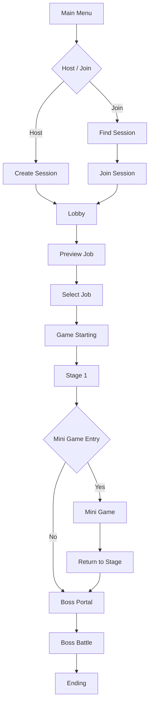

# BangSquad

> **Unreal Engine 5 기반 Listen Server 4인 협동 액션 RPG**  
> 세션 생성부터 로비, 스테이지, 미니게임까지 멀티플레이 상태 일관성을 유지하는 협동 플레이 구조를 구현한 팀 프로젝트입니다.

<p align="center">
  <a href="YOUTUBE_LINK">
    
  </a>
</p>

<p align="center">
  <a href="YOUTUBE_LINK">🎬 플레이 영상</a>
  &nbsp; | &nbsp;
  <a href="PORTFOLIO_PDF_LINK">📄 기술 문서 PDF</a>
  &nbsp; | &nbsp;
  <a href="REPOSITORY_LINK">💻 GitHub Repository</a>
</p>

---

## 목차

1. [프로젝트 요약](#프로젝트-요약)
2. [내 역할](#내-역할)
3. [핵심 기여](#핵심-기여)
4. [트러블슈팅](#트러블슈팅)
5. [게임 진행 구조](#게임-진행-구조)
6. [코드 리뷰 가이드](#코드-리뷰-가이드)
7. [프로젝트 정보](#프로젝트-정보)
8. [참고 사항](#참고-사항)

---

## 프로젝트 요약

**BangSquad**는 서로 다른 직업을 선택한 4명의 플레이어가  
스테이지, 미니게임, 보스전을 협력해 돌파하는 **3D 협동 액션 RPG**입니다.

이 프로젝트에서 저는 게임플레이 전체보다  
**멀티플레이 구조와 상태 동기화 흐름**을 중심으로 담당했습니다.

특히 아래 문제를 해결하는 데 집중했습니다.

- 세션 비동기 처리 시 잘못된 Travel 호출 방지
- Late Join 플레이어의 로비 상태 복원
- 동시 직업 선택으로 인한 Race Condition 방지
- 미니게임 복귀 후 퍼즐/오브젝트 상태 유지
- 서버 기준 미니게임 순위 계산 및 UI 동기화

---

## 내 역할

### 담당 범위

- OnlineSubsystem 기반 세션 생성, 검색, 참가
- 로비 Phase 동기화와 Ready 흐름 처리
- 서버 권한 기반 직업 선택 검증
- 포탈 기반 스테이지 전환과 DataAsset 맵 참조
- CheckPoint 저장 및 복원
- `ISaveInterface` 기반 오브젝트 상태 저장/복원
- 미니게임 순위 계산
- Arena 상태 머신과 결과 UI 반영

### 프로젝트 개요

| 항목 | 내용 |
|---|---|
| 프로젝트명 | BangSquad |
| 프로젝트 유형 | 기업협약 팀 프로젝트 |
| 장르 | 3D 협동 액션 RPG |
| 개발 기간 | 2025.12.22 ~ 2026.03.06 (75일) |
| 개발 인원 | 개발 4명 / 기획 1명 |
| 플랫폼 | Windows PC |
| 엔진 | Unreal Engine 5 |
| 언어 | C++ |
| 네트워크 | Listen Server, OnlineSubsystem, Replication, RPC |

---

## 핵심 기여

### 1. OnlineSubsystem 기반 세션 흐름 구성

세션 생성, 검색, 참가를 모두 **완료 Delegate 기준**으로 이어 붙여  
비동기 작업이 끝나기 전에 `ServerTravel` 또는 `ClientTravel`이 호출되지 않도록 구성했습니다.

```text
CreateSession
  → OnCreateSessionComplete
  → ServerTravel

FindSessions
  → OnFindSessionsComplete
  → Server List UI Update

JoinSession
  → OnJoinSessionComplete
  → ClientTravel
```

관련 코드

- [BSGameInstance.h](./Source/Project_Bang_Squad/Core/BSGameInstance.h)
- [BSGameInstance.cpp](./Source/Project_Bang_Squad/Core/BSGameInstance.cpp)
- [MainMenu.cpp](./Source/Project_Bang_Squad/UI/Menu/MainMenu.cpp)
- [ServerRow.cpp](./Source/Project_Bang_Squad/UI/Menu/ServerRow.cpp)
- [CreateSession 완료 후 ServerTravel](https://github.com/Wandukong22/BangSquad/blob/main/Source/Project_Bang_Squad/Core/BSGameInstance.cpp#L190-L197)
- [FindSession 결과를 서버 목록 DTO로 변환](https://github.com/Wandukong22/BangSquad/blob/main/Source/Project_Bang_Squad/Core/BSGameInstance.cpp#L207-L252)
- [JoinSession 완료 후 ClientTravel](https://github.com/Wandukong22/BangSquad/blob/main/Source/Project_Bang_Squad/Core/BSGameInstance.cpp#L254-L295)

---

### 2. RepNotify 기반 로비 상태 동기화

로비는 `PreviewJob → SelectJob → GameStarting` 순서로 진행되며,  
이 상태를 이벤트가 아니라 **복제되는 상태값**으로 관리해 Late Join 플레이어도 현재 상태를 복원할 수 있게 했습니다.

```text
LobbyGameMode
  → CurrentPhase 변경
  → LobbyGameState Replication
  → OnRep_CurrentPhase
  → Delegate Broadcast
  → Lobby UI 갱신
```

관련 코드

- [LobbyGameMode.h](./Source/Project_Bang_Squad/Game/Lobby/LobbyGameMode.h)
- [LobbyGameState.h](./Source/Project_Bang_Squad/Game/Lobby/LobbyGameState.h)
- [LobbyGameState.cpp](./Source/Project_Bang_Squad/Game/Lobby/LobbyGameState.cpp)
- [LobbyPlayerController.cpp](./Source/Project_Bang_Squad/Game/Lobby/LobbyPlayerController.cpp)
- [LobbyMainWidget.cpp](./Source/Project_Bang_Squad/UI/Lobby/LobbyMainWidget.cpp)
- [CurrentPhase 복제와 서버 수동 OnRep 호출](https://github.com/Wandukong22/BangSquad/blob/main/Source/Project_Bang_Squad/Game/Lobby/LobbyGameState.cpp#L20-L27)
- [OnRep_CurrentPhase / OnRep_TakenJobs 브로드캐스트](https://github.com/Wandukong22/BangSquad/blob/main/Source/Project_Bang_Squad/Game/Lobby/LobbyGameState.cpp#L55-L64)

---

### 3. 서버 권한 기반 직업 선택 검증

직업 선택은 클라이언트 UI가 아니라  
**서버의 `LobbyGameMode`가 최종 승인**하도록 구성했습니다.

클라이언트는 요청만 보내고,  
서버가 `TakenJobs`와 플레이어 상태를 함께 검사한 뒤 확정하도록 설계해  
중복 선택과 상태 꼬임을 방지했습니다.

```text
Client Job Request
  → LobbyPlayerController
  → LobbyGameMode Validation
  → LobbyGameState TakenJobs Update
  → LobbyPlayerState Job Update
  → Client UI Sync
```

관련 코드

- [LobbyGameMode.cpp](./Source/Project_Bang_Squad/Game/Lobby/LobbyGameMode.cpp)
- [LobbyGameState.cpp](./Source/Project_Bang_Squad/Game/Lobby/LobbyGameState.cpp)
- [LobbyPlayerState.cpp](./Source/Project_Bang_Squad/Game/Lobby/LobbyPlayerState.cpp)
- [JobSelectWidget.cpp](./Source/Project_Bang_Squad/UI/Lobby/JobSelectWidget.cpp)
- [JobButton.cpp](./Source/Project_Bang_Squad/UI/Lobby/JobButton.cpp)
- [서버 권한 기반 직업 확정 검증](https://github.com/Wandukong22/BangSquad/blob/main/Source/Project_Bang_Squad/Game/Lobby/LobbyGameMode.cpp#L20-L66)
- [TakenJobs 변경에 따라 버튼 상태 갱신](https://github.com/Wandukong22/BangSquad/blob/main/Source/Project_Bang_Squad/UI/Lobby/JobSelectWidget.cpp#L38-L116)

---

### 4. DataAsset 기반 스테이지 전환

스테이지 이동은 `Stage Index`와 `Section`으로 목적지를 결정하고,  
실제 맵 경로와 로딩/결과 이미지는 `BSMapData`에서 조회하도록 구성했습니다.

또한 포탈은 단순 이동 트리거가 아니라  
**전원 진입 확인 → 카운트다운 → 이동 → 예외 처리**까지 포함하는 흐름으로 설계했습니다.

관련 코드

- [StageGameMode.h](./Source/Project_Bang_Squad/Game/Stage/StageGameMode.h)
- [StageGameMode.cpp](./Source/Project_Bang_Squad/Game/Stage/StageGameMode.cpp)
- [MapPortal.h](./Source/Project_Bang_Squad/Game/Stage/MapPortal.h)
- [MapPortal.cpp](./Source/Project_Bang_Squad/Game/Stage/MapPortal.cpp)
- [BSMapData.h](./Source/Project_Bang_Squad/Data/DataAsset/BSMapData.h)
- [BSMapData.cpp](./Source/Project_Bang_Squad/Data/DataAsset/BSMapData.cpp)
- [포탈 카운트다운과 레벨 전환 처리](https://github.com/Wandukong22/BangSquad/blob/main/Source/Project_Bang_Squad/Game/Stage/MapPortal.cpp#L145-L317)
- [DataAsset 맵 정보 구조와 조회 함수](https://github.com/Wandukong22/BangSquad/blob/main/Source/Project_Bang_Squad/Data/DataAsset/BSMapData.h#L10-L46)

---

### 5. 스테이지 상태 저장 및 복원

미니게임 이후 원래 스테이지로 복귀할 때  
퍼즐과 상호작용 오브젝트가 초기화되지 않도록  
`ISaveInterface` 기반 저장/복원 구조를 만들었습니다.

저장 시스템은 인터페이스만 알고,  
실제 저장 데이터는 각 오브젝트가 직접 구성하게 해서  
새로운 저장 대상을 추가해도 중앙 저장 로직 수정이 최소화되도록 했습니다.

```text
ISaveInterface Actor Collect
  → SaveActorData()
  → SaveID 기준 저장
  → Stage Re-enter
  → Save Data Lookup
  → LoadActorData()
```

관련 코드

- [SaveInterface.h](./Source/Project_Bang_Squad/Game/Interface/SaveInterface.h)
- [SaveInterface.cpp](./Source/Project_Bang_Squad/Game/Interface/SaveInterface.cpp)
- [StageGameMode.cpp](./Source/Project_Bang_Squad/Game/Stage/StageGameMode.cpp)
- [StageGameState.cpp](./Source/Project_Bang_Squad/Game/Stage/StageGameState.cpp)
- [Checkpoint.cpp](./Source/Project_Bang_Squad/Game/Stage/Checkpoint.cpp)
- [ISaveInterface 계약 정의](https://github.com/Wandukong22/BangSquad/blob/main/Source/Project_Bang_Squad/Game/Interface/SaveInterface.h#L10-L37)
- [포탈 이동 직전 퍼즐 상태 저장](https://github.com/Wandukong22/BangSquad/blob/main/Source/Project_Bang_Squad/Game/Stage/MapPortal.cpp#L59-L75)
- [저장 대상 객체의 Save/Load 구현 예시](https://github.com/Wandukong22/BangSquad/blob/main/Source/Project_Bang_Squad/MapPuzzle/CenterStatueManager.cpp#L50-L60)

---

### 6. 서버 기준 실시간 순위 계산

미니게임 순위는 단순 거리 대신  
**체크포인트 진행도 + 다음 체크포인트까지 거리**를 조합한 점수로 계산했습니다.

완주자는 도착 순위를 유지하고,  
미완주자는 진행 점수로 정렬해 플레이 흐름과 체감 순위가 어긋나지 않도록 했습니다.

```text
CheckPoint Progress
  + Distance to Next CheckPoint
  = Progress Score
```

관련 코드

- [MiniGameMode.h](./Source/Project_Bang_Squad/Game/MiniGame/MiniGameMode.h)
- [MiniGameMode.cpp](./Source/Project_Bang_Squad/Game/MiniGame/MiniGameMode.cpp)
- [MiniGameState.h](./Source/Project_Bang_Squad/Game/MiniGame/MiniGameState.h)
- [MiniGameState.cpp](./Source/Project_Bang_Squad/Game/MiniGame/MiniGameState.cpp)
- [MiniGamePlayerState.h](./Source/Project_Bang_Squad/Game/MiniGame/MiniGamePlayerState.h)
- [MiniGamePlayerState.cpp](./Source/Project_Bang_Squad/Game/MiniGame/MiniGamePlayerState.cpp)
- [MiniGameWidget.cpp](./Source/Project_Bang_Squad/UI/MiniGame/MiniGameWidget.cpp)
- [체크포인트 + 거리 기반 진행 점수 계산](https://github.com/Wandukong22/BangSquad/blob/main/Source/Project_Bang_Squad/Game/MiniGame/MiniGamePlayerState.cpp#L38-L75)
- [UI에서 진행 점수 기준 실시간 정렬](https://github.com/Wandukong22/BangSquad/blob/main/Source/Project_Bang_Squad/UI/MiniGame/MiniGameWidget.cpp#L74-L123)

---

### 7. Arena 상태 머신

Arena 미니게임은 `Waiting → Surviving → FloorSinking → Finished` 4단계로 구성했고,  
상태는 `ArenaGameState`에서 복제하고 UI 반응은 `PlayerController`와 위젯에서 처리하도록 나눴습니다.

관련 코드

- [ArenaMiniGameMode.h](./Source/Project_Bang_Squad/Game/MiniGame/ArenaMiniGameMode.h)
- [ArenaMiniGameMode.cpp](./Source/Project_Bang_Squad/Game/MiniGame/ArenaMiniGameMode.cpp)
- [ArenaGameState.h](./Source/Project_Bang_Squad/Game/MiniGame/ArenaGameState.h)
- [ArenaGameState.cpp](./Source/Project_Bang_Squad/Game/MiniGame/ArenaGameState.cpp)
- [ArenaPlayerController.cpp](./Source/Project_Bang_Squad/Game/MiniGame/ArenaPlayerController.cpp)
- [ArenaMainWidget.cpp](./Source/Project_Bang_Squad/UI/MiniGame/ArenaMainWidget.cpp)
- [ArenaFloor.cpp](./Source/Project_Bang_Squad/MapPuzzle/ArenaFloor.cpp)
- [Arena 상태 복제 필드](https://github.com/Wandukong22/BangSquad/blob/main/Source/Project_Bang_Squad/Game/MiniGame/ArenaGameState.cpp#L10-L17)
- [Arena Phase RepNotify 진입점](https://github.com/Wandukong22/BangSquad/blob/main/Source/Project_Bang_Squad/Game/MiniGame/ArenaGameState.cpp#L19-L21)

---

## 트러블슈팅

### 1. 동시에 같은 직업을 선택할 수 있는 Race Condition

직업 선택 버튼을 로컬에서 비활성화하는 것만으로는  
두 플레이어가 거의 동시에 같은 직업을 요청했을 때 충돌을 막을 수 없었습니다.

해결 방식

- 전체 직업 점유 상태를 `LobbyGameState`에서 관리
- 플레이어별 확정 직업은 `LobbyPlayerState`에서 관리
- 모든 요청을 `LobbyGameMode`에서 서버 권한으로 최종 검증
- 기존 직업 해제와 새 직업 등록을 하나의 처리 흐름으로 묶음

```cpp
bool ALobbyGameMode::TryConfirmJob(...)
{
    if (!GameState->IsJobAvailable(Job))
    {
        return false;
    }

    if (RequestingPlayerState->GetIsConfirmedJob())
    {
        GameState->RemoveTakenJob(
            RequestingPlayerState->GetSavedJobType()
        );
    }

    GameState->AddTakenJob(Job);
    RequestingPlayerState->SetSavedJobType(Job);
    RequestingPlayerState->SetIsConfirmedJob(true);

    return true;
}
```

결과

동시에 같은 직업을 요청하더라도  
서버가 먼저 승인한 하나의 요청만 유효하도록 구성했습니다.

---

### 2. 미니게임 복귀 후 오브젝트 상태가 초기화되는 문제

미니게임 맵을 다녀온 뒤 원래 스테이지로 복귀하면  
퍼즐과 상호작용 오브젝트 상태가 초기화되는 문제가 있었습니다.

해결 방식

- 맵 이동 전 `ISaveInterface` 구현 객체를 수집
- 각 객체가 자신의 상태를 `FActorSaveData`로 직렬화
- `SaveID`를 기준으로 `GameInstance`에 상태 저장
- 스테이지 재진입 시 저장된 데이터를 조회해 `LoadActorData()` 호출

결과

맵 전환 이후에도 퍼즐과 오브젝트 상태가 유지되도록 구성했고,  
새로운 저장 대상을 추가할 때도 기존 저장 시스템 수정이 최소화되도록 만들었습니다.

---

### 3. 같은 체크포인트 구간에 있는 플레이어의 순위를 정확히 구분하기 어려운 문제

체크포인트 번호만 기준으로 순위를 계산하면  
같은 구간에 있는 플레이어들의 실제 진행 차이를 반영하기 어려웠습니다.

예를 들어 같은 체크포인트를 지난 두 플레이어가 있더라도,  
누가 다음 체크포인트에 더 가까운지 구분하지 못해 체감 순위와 UI 표시가 어긋날 수 있었습니다.

해결 방식

- 체크포인트 인덱스를 기본 진행도로 사용
- 다음 체크포인트까지의 거리를 추가 점수로 계산
- 완주자는 도착 순위를 그대로 유지
- 미완주자는 진행 점수 기준으로 정렬
- 서버에서 순위를 계산하고 `PlayerState`로 동기화

```text
진행 점수 = 체크포인트 진행도 + 다음 체크포인트까지의 거리 기반 점수
```

결과

같은 체크포인트 구간에 있는 플레이어도 실제 위치 차이를 반영해  
더 자연스럽고 일관된 실시간 순위를 표시할 수 있게 했습니다.

---

## 게임 진행 구조



---

## 코드 리뷰 가이드

아래 순서로 보면 제가 담당한 멀티플레이 흐름을 빠르게 파악할 수 있습니다.

1. [BSGameInstance](./Source/Project_Bang_Squad/Core/BSGameInstance.cpp)
세션 생성, 검색, 참가와 Travel 흐름

2. [LobbyGameMode](./Source/Project_Bang_Squad/Game/Lobby/LobbyGameMode.cpp)
로비 진행 제어와 직업 선택 서버 검증

3. [LobbyGameState](./Source/Project_Bang_Squad/Game/Lobby/LobbyGameState.cpp)
`CurrentPhase`, `TakenJobs` 복제와 Delegate 브로드캐스트

4. [MapPortal](./Source/Project_Bang_Squad/Game/Stage/MapPortal.cpp)
전원 진입 확인, 카운트다운, 저장, 맵 전환

5. [StageGameMode](./Source/Project_Bang_Squad/Game/Stage/StageGameMode.cpp)
체크포인트 기준 리스폰 및 스테이지 복귀 흐름

6. [MiniGamePlayerState](./Source/Project_Bang_Squad/Game/MiniGame/MiniGamePlayerState.cpp)
미니게임 진행 점수 계산 로직

7. [MiniGameWidget](./Source/Project_Bang_Squad/UI/MiniGame/MiniGameWidget.cpp)
실시간 순위 정렬과 결과 보드 출력

8. [ArenaGameState](./Source/Project_Bang_Squad/Game/MiniGame/ArenaGameState.cpp)
Arena 상태 복제

---

## 프로젝트 정보

| 분류 | 사용 기술 |
|---|---|
| Engine | Unreal Engine 5 |
| Language | C++ |
| IDE | Rider |
| Network | Listen Server |
| Online | OnlineSubsystem LAN / Steam |
| Data | DataAsset |
| Framework | Unreal Gameplay Framework |
| Version Control | GitHub |

---

## 참고 사항

- 이 저장소는 포트폴리오용 프로젝트 소개를 목적으로 정리했습니다.
- 실행 빌드 배포보다 영상과 구현 설명 중심으로 확인하는 것을 권장합니다.
- README는 프로젝트 전체 설명보다 제가 담당한 멀티플레이 구조와 문제 해결 흐름이 먼저 보이도록 구성했습니다.
