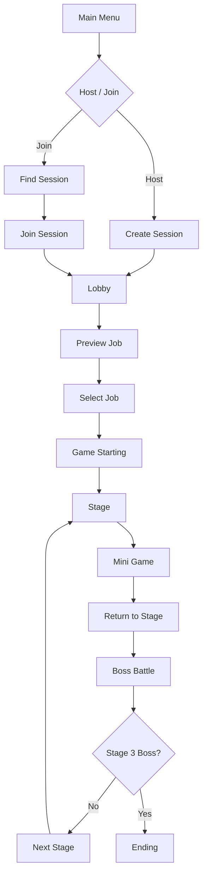

# BangSquad

> **Unreal Engine 5.5 기반 Listen Server 4인 협동 액션 RPG**<br>
> 세션 생성부터 로비, 스테이지, 미니게임까지 멀티플레이 상태 일관성을 유지하는 협동 플레이 구조를 구현한 팀 프로젝트입니다.

<p align="center">
  <a href="https://youtu.be/ivm0kIhvQbI?si=t5cMN_6NRb55eGpj">🎬 플레이 영상</a>
  &nbsp; | &nbsp;
  <a href="./docs/BangSquad_Technical_Document.pdf">📄 기술 문서 PDF</a>
</p>

---

## 프로젝트 요약

**BangSquad**는 4명의 플레이어가 서로 다른 직업을 선택하고,  
협력하여 스테이지, 미니게임, 보스전을 돌파하는 **3D 협동 액션 RPG**입니다.

이 프로젝트에서 저는 게임플레이 전체보다  
**멀티플레이 구조와 상태 동기화 흐름**을 중심으로 담당했습니다.

특히 아래 문제를 해결하는 데 집중했습니다.

- OnlineSubsystem 기반 세션 생성, 검색, 참가 흐름
- RepNotify 기반 로비 상태 동기화
- 서버 권한 기반 직업 선택 검증
- 스테이지 전환과 오브젝트 상태 복원
- 미니게임 실시간 순위 계산과 Arena Phase 전환 및 상태 복제

---

## 프로젝트 정보

| 항목 | 내용 |
|---|---|
| 프로젝트 유형 | 기업협약 팀 프로젝트 |
| 개발 기간 | 2025.12.22 ~ 2026.03.06 (75일) |
| 개발 인원 | 개발 4명 / 기획 1명 |
| 장르 | 3D 협동 액션 RPG |
| 플랫폼 | Windows PC |
| 담당 역할 | 멀티플레이 구조 및 상태 동기화 |

### 담당 범위

아래 내용은 팀 전체 기능 중 제가 직접 구현한 멀티플레이 및 상태 동기화 영역입니다.

- OnlineSubsystem 기반 LAN 세션 생성, 검색, 참가
- 로비 Phase 동기화와 Ready 흐름 처리
- 서버 권한 기반 직업 선택 및 중복 방지
- Portal 기반 스테이지 전환
- 체크포인트, 리스폰, 관전 시스템
- `ISaveInterface` 기반 오브젝트 상태 저장 및 복원
- 미니게임 실시간 순위 계산
- Arena Phase 전환 로직 및 상태 복제

---

## 주요 기능

### 1. OnlineSubsystem 기반 멀티플레이 세션

세션 생성, 검색, 참가를 모두 **완료 Delegate 기준**으로 이어 붙여  
비동기 작업이 끝나기 전에 `ServerTravel` 또는 `ClientTravel`이 호출되지 않도록 구성했습니다.

```text
CreateSession
  → OnCreateSessionComplete
  → ServerTravel

FindSessions
  → OnFindSessionsComplete
  → Server List UI Update

JoinSession
  → OnJoinSessionComplete
  → ClientTravel
```

관련 코드

- [BSGameInstance.cpp](./Source/Project_Bang_Squad/Core/BSGameInstance.cpp)
- [MainMenu.cpp](./Source/Project_Bang_Squad/UI/Menu/MainMenu.cpp)
- [CreateSession 완료 후 ServerTravel](https://github.com/dpdnjs512/BangSquad/blob/main/Source/Project_Bang_Squad/Core/BSGameInstance.cpp#L183-L190)

### 2. RepNotify 기반 로비 상태 동기화

로비는 `PreviewJob → SelectJob → GameStarting` 순서로 진행되며,  
현재 상태를 `LobbyGameState`에 저장하고 `RepNotify`로 복제해, 복제된 Phase와 직업 점유 상태를 기준으로 로비 UI를 초기화하도록 구성했습니다.

관련 코드

- [LobbyGameMode.cpp](./Source/Project_Bang_Squad/Game/Lobby/LobbyGameMode.cpp)
- [LobbyGameState.cpp](./Source/Project_Bang_Squad/Game/Lobby/LobbyGameState.cpp)
- [OnRep_CurrentPhase / OnRep_TakenJobs 브로드캐스트](https://github.com/dpdnjs512/BangSquad/blob/main/Source/Project_Bang_Squad/Game/Lobby/LobbyGameState.cpp#L55-L64)

### 3. 서버 권한 기반 직업 선택

직업 선택은 클라이언트 UI가 아니라  
**서버의 `LobbyGameMode`가 최종 승인**하도록 구성했습니다.

전체 직업 점유 상태는 `LobbyGameState`, 플레이어별 확정 직업은 `LobbyPlayerState`로 분리해  
중복 선택과 상태 꼬임을 방지했습니다.

관련 코드

- [LobbyGameMode.cpp](./Source/Project_Bang_Squad/Game/Lobby/LobbyGameMode.cpp)
- [LobbyPlayerState.cpp](./Source/Project_Bang_Squad/Game/Lobby/LobbyPlayerState.cpp)
- [JobSelectWidget.cpp](./Source/Project_Bang_Squad/UI/Lobby/JobSelectWidget.cpp)
- [서버 권한 기반 직업 확정 검증](https://github.com/dpdnjs512/BangSquad/blob/main/Source/Project_Bang_Squad/Game/Lobby/LobbyGameMode.cpp#L20-L66)

### 4. DataAsset 기반 스테이지 전환

스테이지 이동은 `Stage Index`와 `Section`으로 목적지를 결정하고,  
실제 맵 경로와 로딩/결과 이미지는 `BSMapData`에서 조회하도록 구성했습니다.

또한 포탈은 단순 이동 트리거가 아니라  
**전원 진입 확인 → 카운트다운 → 이동** 흐름까지 포함하도록 설계했습니다.

관련 코드

- [MapPortal.cpp](./Source/Project_Bang_Squad/Game/Stage/MapPortal.cpp)
- [BSGameInstance.cpp](./Source/Project_Bang_Squad/Core/BSGameInstance.cpp) — DataAsset 조회와 ServerTravel
- [BSMapData.h](./Source/Project_Bang_Squad/Data/DataAsset/BSMapData.h)

### 5. 오브젝트 상태 저장 및 복원

미니게임 이후 원래 스테이지로 복귀할 때  
퍼즐과 상호작용 오브젝트가 초기화되지 않도록  
`ISaveInterface` 기반 저장/복원 구조를 만들었습니다.

```text
ISaveInterface Actor Collect
  → SaveActorData()
  → SaveID 기준 저장
  → Stage Re-enter
  → Save Data Lookup
  → LoadActorData()
```

관련 코드

- [SaveInterface.h](./Source/Project_Bang_Squad/Game/Interface/SaveInterface.h)
- [MapPortal.cpp](./Source/Project_Bang_Squad/Game/Stage/MapPortal.cpp)
- [CenterStatueManager.cpp](./Source/Project_Bang_Squad/MapPuzzle/CenterStatueManager.cpp)

### 6. 미니게임 순위 계산과 Arena 상태 머신

미니게임 순위는 **체크포인트 진행도 + 다음 체크포인트까지 거리**를 조합한 점수로 계산했고,  
Arena 미니게임의 진행 상태를 `Waiting`, `Surviving`, `FloorSinking`, `Finished`로 구분했습니다.
생존 중에는 `Surviving`과 `FloorSinking` 단계를 반복합니다.
서버의 `ArenaMiniGameMode`가 Phase 전환 조건과 단계별 처리를 담당하고, `ArenaGameState`가 현재 Phase와 남은 시간, 가라앉을 바닥 번호를 복제합니다.

관련 코드

- [MiniGamePlayerState.cpp](./Source/Project_Bang_Squad/Game/MiniGame/MiniGamePlayerState.cpp)
- [MiniGameWidget.cpp](./Source/Project_Bang_Squad/UI/MiniGame/MiniGameWidget.cpp)
- [ArenaMiniGameMode.cpp](./Source/Project_Bang_Squad/Game/MiniGame/ArenaMiniGameMode.cpp) — Phase 전환 조건과 단계별 처리
- [ArenaGameState.cpp](./Source/Project_Bang_Squad/Game/MiniGame/ArenaGameState.cpp) — Phase, 남은 시간, 바닥 번호 복제

---

## 트러블슈팅

### 1. 직업 선택 Race Condition

클라이언트 UI에서 선택된 직업 버튼을 비활성화해도,  
패킷이 서버에 도착하기 전 두 플레이어가 동시에 같은 직업을 선택할 수 있었습니다.

- 원인: UI 비활성화만으로 서버 최종 상태를 보장할 수 없었음
- 해결: `LobbyGameMode`에서 서버 권한으로 최종 검증하고 `LobbyGameState` / `LobbyPlayerState`로 상태를 분리 관리
- 결과: 동일한 직업에 대한 요청이 동시에 들어와도 서버에서 하나의 직업만 확정되도록 보장

### 2. Seamless Travel 생명주기 충돌

Lobby에서 Stage로 Seamless Travel을 수행할 때  
간헐적으로 `Access Violation`이 발생했습니다.

- 원인: 이전 World에서 등록한 반복 Timer 콜백이 Travel 이후에도 실행되며 유효하지 않은 객체를 참조
- 해결: 반복 Timer를 제거하고 새로운 World의 `BeginPlay()`에서 UI를 직접 초기화하도록 변경
- 결과: Lobby에서 Stage 전환 시 Access Violation 제거, World 생명주기에 맞는 UI 초기화 구조 확보

### 3. Replication 초기화 순서 문제

MiniGame 이후 기존 Stage로 복귀하면 일부 클라이언트에서  
`RisingPlatform`만 원래 위치로 복원되지 않는 문제가 있었습니다.

- 원인: 복제 상태가 적용될 때 `EndLocation`이 아직 계산되지 않아 잘못된 위치가 적용됨
- 해결: `BeginPlay()`에서 기준 위치를 먼저 계산한 뒤 저장/복제 상태를 반영하도록 순서를 변경
- 결과: 저장 및 복제 적용 순서와 관계없이 같은 최종 위치를 보장

---

## 게임 진행 구조



---

## 기술 스택

| 분류 | 사용 기술 |
|---|---|
| Engine | Unreal Engine 5.5 |
| Language | C++ |
| IDE | Rider |
| Architecture | Listen Server |
| Online | OnlineSubsystem LAN |
| Networking | Replication / RPC |
| Data | DataAsset |
| Version Control | GitHub |

---

## 회고

이 프로젝트를 통해 멀티플레이 게임에서는 기능 구현 자체보다  
**상태를 누가 소유하고, 누가 변경하며, 어떤 시점에 동기화할지 결정하는 구조 설계**가 중요하다는 점을 배웠습니다.

특히 서버 권한 직업 선택, Seamless Travel 생명주기 충돌, Replication 초기화 순서 문제를 해결하면서  
Unreal Engine의 Gameplay Framework와 멀티플레이 상태 동기화를 실제 프로젝트 단위로 경험할 수 있었습니다.
