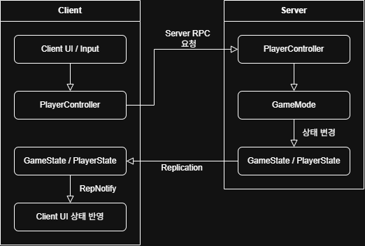
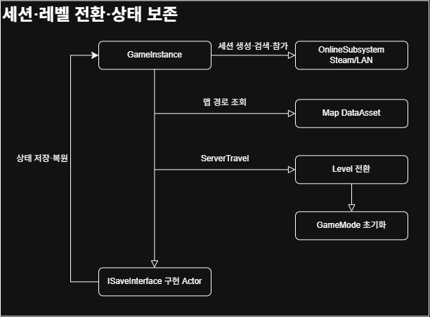

# BangSquad

> **Unreal Engine 5.5 기반 Listen Server 4인 협동 액션 RPG**<br>
> 세션 생성부터 로비, 스테이지, 미니게임까지 멀티플레이 상태 일관성을 유지하는 협동 플레이 구조를 구현한 팀 프로젝트입니다.

<p align="center">
  <a href="https://youtu.be/ivm0kIhvQbI?si=t5cMN_6NRb55eGpj">🎬 플레이 영상</a>
  &nbsp; | &nbsp;
  <a href="./docs/BangSquad_Technical_Document.pdf">📄 기술 문서 PDF</a>
</p>

---

## 프로젝트 개요

**BangSquad**는 4명의 플레이어가 서로 다른 직업을 선택하고,  
협력하여 스테이지, 미니게임, 보스전을 돌파하는 **3D 협동 액션 RPG**입니다.

| 항목 | 내용 |
|---|---|
| 프로젝트 유형 | 기업협약 팀 프로젝트 |
| 개발 기간 | 2025.12.22 ~ 2026.03.06 (75일) |
| 개발 인원 | 개발 4명 / 기획 1명 |
| 장르 | 3D 협동 액션 RPG |
| 플랫폼 | Windows PC |
| 담당 역할 | 멀티플레이 구조 및 상태 동기화 |

---

## 기술 스택

| 분류 | 사용 기술 |
|---|---|
| Engine | Unreal Engine 5.5 |
| Language | C++ |
| UI | UMG |
| Multiplayer | Listen Server |
| Online | OnlineSubsystem — Steam 연동 / LAN 테스트 |
| Networking | Replication / RPC / RepNotify |
| Data | DataAsset |
| Tools | Rider / Git / GitHub |

---

## 아키텍처

클라이언트의 상태 변경 요청은 서버에서 검증하고, 확정된 상태는 `GameState`와 `PlayerState`를 통해 각 클라이언트에 복제하도록 구성했습니다.

### 멀티플레이 상태 동기화

<p align="center">
  
</p>

### 세션·레벨 전환·상태 보존

<p align="center">
  
</p>

---

## 주요 구현 기능

### 1. 멀티플레이 세션

#### OnlineSubsystem 기반 세션 생성·검색·참가

**핵심 코드**

- [세션 생성 완료 후 Listen Server 이동](https://github.com/dpdnjs512/BangSquad/blob/5b48ad96f89edc824cc0c979c146898fdf9758e9/Source/Project_Bang_Squad/Core/BSGameInstance.cpp#L183-L188) — 세션 생성 성공을 확인한 뒤 로비 맵으로 `ServerTravel`하는 코드
- [검색 결과를 서버 목록 UI 데이터로 변환](https://github.com/dpdnjs512/BangSquad/blob/5b48ad96f89edc824cc0c979c146898fdf9758e9/Source/Project_Bang_Squad/Core/BSGameInstance.cpp#L200-L237) — 검색된 세션의 인원과 방 정보를 UI에 전달하는 코드
- [세션 참가 완료 후 ClientTravel](https://github.com/dpdnjs512/BangSquad/blob/5b48ad96f89edc824cc0c979c146898fdf9758e9/Source/Project_Bang_Squad/Core/BSGameInstance.cpp#L242-L276) — 접속 주소를 얻어 참가 클라이언트를 호스트 맵으로 이동시키는 코드

세션 생성, 검색, 참가를 모두 **완료 Delegate 기준**으로 이어 붙여  
비동기 작업이 끝나기 전에 `ServerTravel` 또는 `ClientTravel`이 호출되지 않도록 구성했습니다.

```text
CreateSession
  → OnCreateSessionComplete
  → ServerTravel

FindSessions
  → OnFindSessionsComplete
  → Server List UI Update

JoinSession
  → OnJoinSessionComplete
  → ClientTravel
```

**관련 코드**

- [BSGameInstance.cpp](./Source/Project_Bang_Squad/Core/BSGameInstance.cpp)
- [MainMenu.cpp](./Source/Project_Bang_Squad/UI/Menu/MainMenu.cpp)

### 2. 로비

#### RepNotify 기반 상태 동기화

**핵심 코드**

- [로비 상태 복제 등록과 서버 Phase 변경](https://github.com/dpdnjs512/BangSquad/blob/5b48ad96f89edc824cc0c979c146898fdf9758e9/Source/Project_Bang_Squad/Game/Lobby/LobbyGameState.cpp#L12-L25) — Phase와 직업 점유 상태를 복제 대상으로 등록하고 서버에서만 Phase를 변경하는 코드
- [RepNotify를 통한 UI 갱신 이벤트 전달](https://github.com/dpdnjs512/BangSquad/blob/5b48ad96f89edc824cc0c979c146898fdf9758e9/Source/Project_Bang_Squad/Game/Lobby/LobbyGameState.cpp#L55-L64) — 복제된 Phase와 직업 점유 상태를 Delegate로 브로드캐스트하는 코드

로비는 `PreviewJob → SelectJob → GameStarting` 순서로 진행되며,  
현재 상태를 `LobbyGameState`에 저장하고 `RepNotify`로 복제해, 복제된 Phase와 직업 점유 상태를 기준으로 로비 UI를 초기화하도록 구성했습니다.

**관련 코드**

- [LobbyGameMode.cpp](./Source/Project_Bang_Squad/Game/Lobby/LobbyGameMode.cpp)
- [LobbyGameState.cpp](./Source/Project_Bang_Squad/Game/Lobby/LobbyGameState.cpp)
- [LobbyPlayerController.cpp](./Source/Project_Bang_Squad/Game/Lobby/LobbyPlayerController.cpp)

#### 서버 권한 기반 직업 선택

**핵심 코드**

- [직업 선택 요청을 서버 GameMode로 전달](https://github.com/dpdnjs512/BangSquad/blob/5b48ad96f89edc824cc0c979c146898fdf9758e9/Source/Project_Bang_Squad/Game/Lobby/LobbyPlayerController.cpp#L262-L279) — Server RPC에서 요청한 플레이어와 직업 정보를 검증 로직으로 전달하는 코드
- [서버 권한 기반 직업 확정 검증](https://github.com/dpdnjs512/BangSquad/blob/5b48ad96f89edc824cc0c979c146898fdf9758e9/Source/Project_Bang_Squad/Game/Lobby/LobbyGameMode.cpp#L20-L65) — 직업 점유 여부를 다시 확인하고 전체 점유 상태와 플레이어별 확정 상태를 갱신하는 코드

직업 선택은 클라이언트 UI가 아니라  
**서버의 `LobbyGameMode`가 최종 승인**하도록 구성했습니다.

전체 직업 점유 상태는 `LobbyGameState`, 플레이어별 확정 직업은 `LobbyPlayerState`로 분리해  
중복 선택과 상태 꼬임을 방지했습니다.

**관련 코드**

- [LobbyGameMode.cpp](./Source/Project_Bang_Squad/Game/Lobby/LobbyGameMode.cpp)
- [LobbyPlayerController.cpp](./Source/Project_Bang_Squad/Game/Lobby/LobbyPlayerController.cpp)
- [LobbyPlayerState.cpp](./Source/Project_Bang_Squad/Game/Lobby/LobbyPlayerState.cpp)
- [JobSelectWidget.cpp](./Source/Project_Bang_Squad/UI/Lobby/JobSelectWidget.cpp)

### 3. 스테이지 전환 및 상태 보존

#### DataAsset 기반 스테이지 전환

**핵심 코드**

- [Stage와 Section 기반 맵 경로 조회](https://github.com/dpdnjs512/BangSquad/blob/5b48ad96f89edc824cc0c979c146898fdf9758e9/Source/Project_Bang_Squad/Data/DataAsset/BSMapData.cpp#L6-L25) — 열거형 조합에 맞는 맵 정보를 찾아 실제 레벨 경로로 변환하는 코드
- [포탈 진입 인원 확인과 카운트다운 제어](https://github.com/dpdnjs512/BangSquad/blob/5b48ad96f89edc824cc0c979c146898fdf9758e9/Source/Project_Bang_Squad/Game/Stage/MapPortal.cpp#L145-L182) — 서버에서 전원 진입을 확인해 이동 카운트다운을 시작하거나 취소하는 코드
- [로딩 UI 동기화 후 ServerTravel](https://github.com/dpdnjs512/BangSquad/blob/5b48ad96f89edc824cc0c979c146898fdf9758e9/Source/Project_Bang_Squad/Core/BSGameInstance.cpp#L413-L447) — 모든 클라이언트에 로딩 화면을 표시한 뒤 DataAsset의 경로로 이동하는 코드

스테이지 이동은 `Stage Index`와 `Section`으로 목적지를 결정하고,  
실제 맵 경로와 로딩/결과 이미지는 `BSMapData`에서 조회하도록 구성했습니다.

또한 포탈은 단순 이동 트리거가 아니라  
**전원 진입 확인 → 카운트다운 → 이동** 흐름까지 포함하도록 설계했습니다.

**관련 코드**

- [MapPortal.cpp](./Source/Project_Bang_Squad/Game/Stage/MapPortal.cpp)
- [BSGameInstance.cpp](./Source/Project_Bang_Squad/Core/BSGameInstance.cpp)
- [BSMapData.h](./Source/Project_Bang_Squad/Data/DataAsset/BSMapData.h)

#### ISaveInterface 기반 오브젝트 상태 저장 및 복원

**핵심 코드**

- [저장 데이터 구조와 인터페이스 규약](https://github.com/dpdnjs512/BangSquad/blob/5b48ad96f89edc824cc0c979c146898fdf9758e9/Source/Project_Bang_Squad/Game/Interface/SaveInterface.h#L9-L37) — 오브젝트별 저장 데이터와 저장·복원 함수 계약을 정의한 코드
- [ISaveInterface 구현 Actor 수집 및 저장](https://github.com/dpdnjs512/BangSquad/blob/5b48ad96f89edc824cc0c979c146898fdf9758e9/Source/Project_Bang_Squad/Game/Stage/MapPortal.cpp#L54-L72) — 맵의 저장 대상 Actor를 모아 `SaveID`별 데이터를 `GameInstance`에 전달하는 코드
- [SaveID 기반 상태 보관과 조회](https://github.com/dpdnjs512/BangSquad/blob/5b48ad96f89edc824cc0c979c146898fdf9758e9/Source/Project_Bang_Squad/Core/BSGameInstance.h#L274-L281) — 레벨 전환 후에도 사용할 오브젝트 상태를 ID 기준으로 저장하는 코드

미니게임 이후 원래 스테이지로 복귀할 때  
퍼즐과 상호작용 오브젝트가 초기화되지 않도록  
`ISaveInterface` 기반 저장/복원 구조를 만들었습니다.

```text
ISaveInterface Actor Collect
  → SaveActorData()
  → SaveID 기준 저장
  → Stage Re-enter
  → Save Data Lookup
  → LoadActorData()
```

**관련 코드**

- [SaveInterface.h](./Source/Project_Bang_Squad/Game/Interface/SaveInterface.h)
- [MapPortal.cpp](./Source/Project_Bang_Squad/Game/Stage/MapPortal.cpp)
- [RisingPlatform.cpp](./Source/Project_Bang_Squad/MapPuzzle/RisingPlatform.cpp)
- [CenterStatueManager.cpp](./Source/Project_Bang_Squad/MapPuzzle/CenterStatueManager.cpp)

### 4. 미니게임

#### 실시간 순위 계산

**핵심 코드**

- [체크포인트와 거리를 조합한 진행도 점수 계산](https://github.com/dpdnjs512/BangSquad/blob/5b48ad96f89edc824cc0c979c146898fdf9758e9/Source/Project_Bang_Squad/Game/MiniGame/MiniGamePlayerState.cpp#L46-L74) — 통과한 체크포인트에 가중치를 주고 다음 체크포인트까지의 거리로 동률을 구분하는 코드
- [진행도 점수 기반 실시간 순위 UI 갱신](https://github.com/dpdnjs512/BangSquad/blob/5b48ad96f89edc824cc0c979c146898fdf9758e9/Source/Project_Bang_Squad/UI/MiniGame/MiniGameWidget.cpp#L74-L116) — 플레이어를 점수순으로 정렬하고 순위 행을 갱신하는 코드

미니게임 순위는 **체크포인트 진행도 + 다음 체크포인트까지 거리**를 조합한 점수로 계산했습니다.

**관련 코드**

- [MiniGamePlayerState.cpp](./Source/Project_Bang_Squad/Game/MiniGame/MiniGamePlayerState.cpp)
- [MiniGameMode.cpp](./Source/Project_Bang_Squad/Game/MiniGame/MiniGameMode.cpp)
- [MiniGameWidget.cpp](./Source/Project_Bang_Squad/UI/MiniGame/MiniGameWidget.cpp)

#### Arena 상태 머신 및 상태 복제

**핵심 코드**

- [Arena Phase 전환과 바닥 침하 처리](https://github.com/dpdnjs512/BangSquad/blob/5b48ad96f89edc824cc0c979c146898fdf9758e9/Source/Project_Bang_Squad/Game/MiniGame/ArenaMiniGameMode.cpp#L86-L165) — 서버에서 남은 시간과 바닥 번호를 기준으로 `Surviving`과 `FloorSinking`을 전환하는 코드
- [Arena 진행 상태 복제 등록](https://github.com/dpdnjs512/BangSquad/blob/5b48ad96f89edc824cc0c979c146898fdf9758e9/Source/Project_Bang_Squad/Game/MiniGame/ArenaGameState.cpp#L8-L14) — 현재 Phase, 남은 시간, 가라앉을 바닥 번호를 클라이언트에 복제하는 코드

Arena 미니게임의 진행 상태를 `Waiting`, `Surviving`, `FloorSinking`, `Finished`로 구분했습니다.
생존 중에는 `Surviving`과 `FloorSinking` 단계를 반복합니다.
서버의 `ArenaMiniGameMode`가 Phase 전환 조건과 단계별 처리를 담당하고, `ArenaGameState`가 현재 Phase와 남은 시간, 가라앉을 바닥 번호를 복제합니다.

**관련 코드**

- [ArenaMiniGameMode.cpp](./Source/Project_Bang_Squad/Game/MiniGame/ArenaMiniGameMode.cpp)
- [ArenaGameState.cpp](./Source/Project_Bang_Squad/Game/MiniGame/ArenaGameState.cpp)

### 5. 체크포인트·리스폰·관전

**핵심 코드**

- [서버 권한 체크포인트 갱신](https://github.com/dpdnjs512/BangSquad/blob/5b48ad96f89edc824cc0c979c146898fdf9758e9/Source/Project_Bang_Squad/Game/Stage/Checkpoint.cpp#L21-L53) — 서버에서 플레이어 진입을 판정해 스테이지 또는 미니게임 진행도를 갱신하는 코드
- [체크포인트 진행도 복제와 레벨 간 보존](https://github.com/dpdnjs512/BangSquad/blob/5b48ad96f89edc824cc0c979c146898fdf9758e9/Source/Project_Bang_Squad/Game/Stage/StageGameState.cpp#L9-L47) — 최신 체크포인트를 복제하고 `GameInstance`에도 저장해 같은 스테이지 내 레벨 전환 후 복원하는 코드
- [최신 체크포인트 기반 리스폰](https://github.com/dpdnjs512/BangSquad/blob/5b48ad96f89edc824cc0c979c146898fdf9758e9/Source/Project_Bang_Squad/Game/Stage/StageGameMode.cpp#L24-L105) — 저장된 체크포인트 위치와 사망 횟수에 따른 대기 시간을 계산해 캐릭터를 다시 배치하는 코드
- [생존 플레이어 순환 관전](https://github.com/dpdnjs512/BangSquad/blob/5b48ad96f89edc824cc0c979c146898fdf9758e9/Source/Project_Bang_Squad/Game/Stage/StagePlayerController.cpp#L128-L173) — 사망한 플레이어가 생존 중인 동료만 순서대로 전환해 관전하는 코드

체크포인트 진입은 서버에서 판정하고, 최신 진행도를 `StageGameState`와 `GameInstance`에 저장해 같은 스테이지 내 레벨 전환 이후에도 유지하도록 구성했습니다.

플레이어가 사망하면 서버의 `GameMode`가 리스폰 대기 시간과 위치를 결정하고, 최신 체크포인트에서 캐릭터를 다시 생성합니다.
리스폰을 기다리는 동안에는 `PlayerController`가 생존한 플레이어만 필터링해 관전 대상을 순환하도록 구현했습니다.

**관련 코드**

- [Checkpoint.cpp](./Source/Project_Bang_Squad/Game/Stage/Checkpoint.cpp)
- [StageGameState.cpp](./Source/Project_Bang_Squad/Game/Stage/StageGameState.cpp)
- [StageGameMode.cpp](./Source/Project_Bang_Squad/Game/Stage/StageGameMode.cpp)
- [BSGameMode.cpp](./Source/Project_Bang_Squad/Game/Base/BSGameMode.cpp)
- [StagePlayerController.cpp](./Source/Project_Bang_Squad/Game/Stage/StagePlayerController.cpp)

---

## 담당 역할 및 기여

팀 전체 게임플레이 중 멀티플레이 구조와 상태 동기화 영역을 담당했습니다.

| 담당 영역 | 구현 내용 |
|---|---|
| 세션 | OnlineSubsystem 기반 세션 생성, 검색, 참가 |
| 로비 | Phase 및 Ready 상태 동기화 |
| 직업 선택 | 서버 권한 검증과 중복 선택 방지 |
| 스테이지 전환 | 포탈 진입 인원 확인, 카운트다운, 레벨 이동 |
| 체크포인트·리스폰·관전 | 진행도 저장, 체크포인트 리스폰, 생존 플레이어 순환 관전 |
| 상태 보존 | `ISaveInterface` 기반 퍼즐 상태 저장·복원 |
| 미니게임 | 실시간 순위 계산과 Arena Phase 복제 |

---

## 트러블슈팅

### 1. 직업 선택 Race Condition

클라이언트 UI에서 선택된 직업 버튼을 비활성화해도,  
패킷이 서버에 도착하기 전 두 플레이어가 동시에 같은 직업을 선택할 수 있었습니다.

- 원인: UI 비활성화만으로 서버 최종 상태를 보장할 수 없었음
- 해결: `LobbyGameMode`에서 서버 권한으로 최종 검증하고 `LobbyGameState` / `LobbyPlayerState`로 상태를 분리 관리
- 결과: 동일한 직업에 대한 요청이 동시에 들어와도 서버에서 하나의 직업만 확정되도록 보장

### 2. Seamless Travel 생명주기 충돌

Lobby에서 Stage로 Seamless Travel을 수행할 때  
간헐적으로 `Access Violation`이 발생했습니다.

- 원인: 이전 World에서 등록한 반복 Timer 콜백이 Travel 이후에도 실행되며 유효하지 않은 객체를 참조
- 해결: 반복 Timer를 제거하고 새로운 World의 `BeginPlay()`에서 UI를 직접 초기화하도록 변경
- 결과: Lobby에서 Stage 전환 시 Access Violation 제거, World 생명주기에 맞는 UI 초기화 구조 확보

### 3. Replication 초기화 순서 문제

MiniGame 이후 기존 Stage로 복귀하면 일부 클라이언트에서  
`RisingPlatform`만 원래 위치로 복원되지 않는 문제가 있었습니다.

- 원인: 복제 상태가 적용될 때 `EndLocation`이 아직 계산되지 않아 잘못된 위치가 적용됨
- 해결: `BeginPlay()`에서 기준 위치를 먼저 계산한 뒤 저장/복제 상태를 반영하도록 순서를 변경
- 결과: 저장 및 복제 적용 순서와 관계없이 같은 최종 위치를 보장
